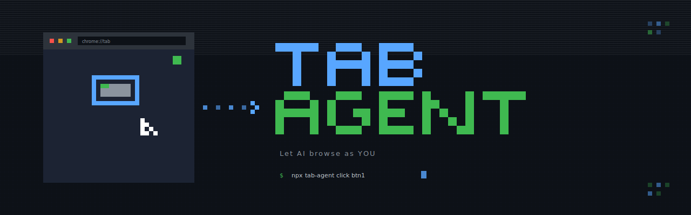
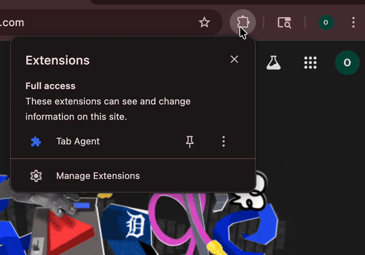

# Tab Agent

[](https://www.npmjs.com/package/tab-agent)
[](https://github.com/DrHB/tab-agent)
[](https://opensource.org/licenses/MIT)

**Let Claude & Codex browse as YOU** — uses your existing logins, click-to-activate security.

> No headless browser. No re-authenticating. Your AI uses your actual Chrome sessions.
>
> **Safari support is experimental** — [see below](#experimental-safari-support)

```
┌─────────────────┐     ┌─────────────────┐     ┌─────────────────┐
│  Claude Code    │────▶│  Relay Server   │────▶│    Extension    │
│    or Codex     │◀────│   (background)  │◀────│    (Chrome)     │
└─────────────────┘     └─────────────────┘     └─────────────────┘
                                                       │
                                                       ▼
                                             ┌───────────────────┐
                                             │  Your Active Tab  │
                                             │   🟢 Click to ON  │
                                             └───────────────────┘
```

## Why Tab Agent?

Most browser automation tools (Playwright, Puppeteer, agent-browser) spin up a **fresh headless browser** — you start logged out of everything, and many sites actively block them. They detect headless browsers through missing plugins, `navigator.webdriver` flags, and other fingerprints.

Tab Agent is different — it uses your real Chrome with your real cookies:

```
+---------------+--------------------------------------+----------------------------------+
|               | Tab Agent                            | Headless Browsers                |
+---------------+--------------------------------------+----------------------------------+
| Your logins   | (+) Uses existing sessions           | (-) Must re-authenticate         |
| Security      | (+) Click to activate specific tabs  | (-) Full browser access          |
| Privacy       | (+) Credentials never leave browser  | (-) Agent sees everything        |
| Detection     | (+) Real browser, real cookies       | (-) Often blocked by anti-bot    |
| Setup         | (+) Uses your Chrome                 | (-) Downloads separate browser   |
| Visibility    | (+) Watch in real browser            | (-) Runs hidden/headless         |
+---------------+--------------------------------------+----------------------------------+
```

**Use Tab Agent when:** Claude or Codex needs to browse as "you" — shopping with your Prime account, checking your GitHub notifications, using sites you're already logged into.

**Use headless browsers when:** CI/CD automation, web scraping, or testing with fresh sessions.

## Features

- **Full browser control** — navigate, click, type, scroll, hover, drag, screenshot, PDF, run JavaScript
- **Uses your login sessions** — access GitHub, Gmail, Amazon without sharing credentials
- **Runs in background** — run `npx tab-agent start` once, then use commands while it stays running
- **Click-to-activate security** — only tabs you explicitly enable, others stay private
- **AI-optimized snapshots** — pages converted to text with refs `[e1]`, `[e2]` for easy targeting
- **Works with Claude Code & Codex** — installs skills automatically
- **Auto-launches Chrome** — starts Chrome with profile selection if not already running

## Quick Start

```bash
# 1. Install extension
git clone https://github.com/DrHB/tab-agent
# Chrome: chrome://extensions → Developer mode → Load unpacked → select extension/

# 2. Setup
npx tab-agent setup

# 3. Start relay
npx tab-agent start

# 4. Activate & go
# Click extension icon on any tab (turns green)
# Ask Claude/Codex: "Search Amazon for mechanical keyboards and find the best rated"
```

<p align="center">
  
</p>

## Example Tasks

```bash
# Research
"Go to Hacker News and summarize the top 5 stories"

# Shopping (uses your login!)
"Search Amazon for protein powder, filter by 4+ stars, find the best value"

# Social Media
"Check my GitHub notifications and list unread ones"

# Data Extraction
"Get the titles and prices of the first 10 products on this page"

# Automation
"Fill out this form with my details"
```

## Commands

```bash
# Core workflow
npx tab-agent snapshot                # Get page content with refs [e1], [e2]...
npx tab-agent click <ref>             # Click element (e.g., click e5)
npx tab-agent type <ref> <text>       # Type into element
npx tab-agent fill <ref> <value>      # Fill form field

# Navigation & interaction
npx tab-agent navigate <url>          # Go to URL
npx tab-agent scroll <dir> [amount]   # Scroll up/down
npx tab-agent press <key>             # Press key (Enter, Escape, Tab)
npx tab-agent hover <ref>             # Hover over element
npx tab-agent select <ref> <value>    # Select dropdown option
npx tab-agent drag <from> <to>        # Drag and drop between elements

# Data extraction
npx tab-agent get text <ref>          # Get element text
npx tab-agent get value <ref>         # Get input value
npx tab-agent get attr <ref> href     # Get element attribute
npx tab-agent get url                 # Get current URL
npx tab-agent get title               # Get page title

# Semantic locators
npx tab-agent find text "Submit"      # Find elements by text
npx tab-agent find role button        # Find by ARIA role
npx tab-agent find label "Email"      # Find by label text
npx tab-agent find placeholder "Search" # Find by placeholder

# Utilities
npx tab-agent tabs                    # List active tabs
npx tab-agent wait <text>             # Wait for text to appear
npx tab-agent wait --url <pattern>    # Wait for URL to match
npx tab-agent wait --visible <ref>    # Wait for element to be visible
npx tab-agent screenshot [--full]     # Capture page (fallback for complex UIs)
npx tab-agent pdf [filename.pdf]      # Save page as PDF
npx tab-agent evaluate <script>       # Run JavaScript
npx tab-agent cookies get             # View cookies
npx tab-agent cookies clear           # Clear cookies
npx tab-agent storage get [key]       # Read localStorage
npx tab-agent storage set <key> <val> # Write localStorage
npx tab-agent storage remove <key>    # Remove localStorage key (or use rm)
npx tab-agent storage clear           # Clear localStorage
```

**Workflow:** `snapshot` → use refs → `click`/`type` → `snapshot` again → repeat

## Installation

### 1. Load Extension

```bash
git clone https://github.com/DrHB/tab-agent
```

1. Open `chrome://extensions`
2. Enable **Developer mode** (top right)
3. Click **Load unpacked**
4. Select the `extension/` folder

### 2. Run Setup

```bash
npx tab-agent setup
```

This auto-detects your extension and configures everything.

### 3. Start Relay

```bash
npx tab-agent start
```

Keep this running in a terminal while you use `tab-agent` commands.

### 4. Activate Tabs

Click the Tab Agent icon on any tab you want to control. Green = active.

## Auto-Launch Chrome

When you run `npx tab-agent start`, Chrome is automatically launched if it's not already running. You'll be prompted to select which Chrome profile to use:

```
Chrome is not running.

Chrome Profiles:
  1. Person 1 (Default)
  2. Work (Profile 1)
  3. Personal (Profile 2)

Select profile [1-3]:
```

### Non-Interactive Mode

Skip the prompt with the `--profile` flag:

```bash
npx tab-agent start --profile="Profile 1"
npx tab-agent start --profile="Work"
```

The flag matches by profile name or directory name (case-insensitive). If Chrome is already running, the prompt is skipped entirely.

## Experimental Safari Support

> **Note:** Safari support is experimental and requires source build steps. Relay + CLI routing work, but Safari packaging is still manual in Xcode.

### Prerequisites

- macOS 14+ (Sonoma or later)
- Xcode 15+ (free from App Store)
- Node.js 18+

### Setup Steps

1. **Start the relay server** (in a terminal):
   ```bash
   npx tab-agent start
   ```

2. **Open the Safari Swift package in Xcode**:
   ```bash
   open -a Xcode safari/Package.swift
   ```

3. **Create/configure a Safari Web Extension target in Xcode**:
   - File → New → Target → Safari Web Extension
   - Point it to the shared extension assets in `extension/`
   - Use `extension/manifest.safari.json` settings as the Safari manifest baseline

4. **Run the app target**:
   - Click "Run" in Xcode (⌘R)

5. **Enable the extension in Safari**:
   - Safari → Settings → Extensions
   - Check "Tab Agent"

6. **Enable unsigned extensions** (required after each Safari restart):
   - Safari → Develop → Allow Unsigned Extensions

7. **Test the connection**:
   ```bash
   npx tab-agent tabs --browser=safari
   ```

### Using with Both Browsers

If you have both Chrome and Safari set up:

```bash
# Auto-detect (uses whichever has activated tabs)
npx tab-agent snapshot

# Explicitly target a browser
npx tab-agent snapshot --browser=safari
npx tab-agent snapshot --browser=chrome

# See tabs from all browsers
npx tab-agent tabs
```

## Supported Browsers

- Google Chrome
- Brave
- Microsoft Edge
- Chromium
- Safari (experimental, manual source setup)

## Troubleshooting

**Extension not detected?**
- Make sure Developer mode is enabled in chrome://extensions
- Reload the extension

**Commands not working?**
- Make sure relay is running: `npx tab-agent start`
- Click the extension icon — must show green "ON"
- Run `npx tab-agent status` to check configuration

**No active tabs?**
- Activate at least one tab by clicking the extension icon

## How It Works

1. **Chrome Extension** — Injects into activated tabs, captures DOM snapshots
2. **Relay Server** — Bridges AI ↔ Extension via native messaging (run with `npx tab-agent start`)
3. **CLI** — Simple commands for Claude Code and Codex

```
You: "Find cheap flights to Tokyo"
 ↓
Claude → npx tab-agent navigate "google.com/flights"
    → npx tab-agent snapshot
    → npx tab-agent type e5 "Tokyo"
    → npx tab-agent click e12
    → ...
```

## License

MIT
